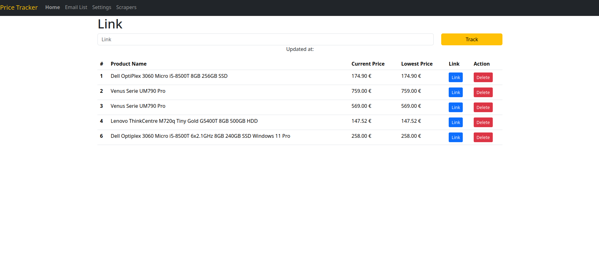
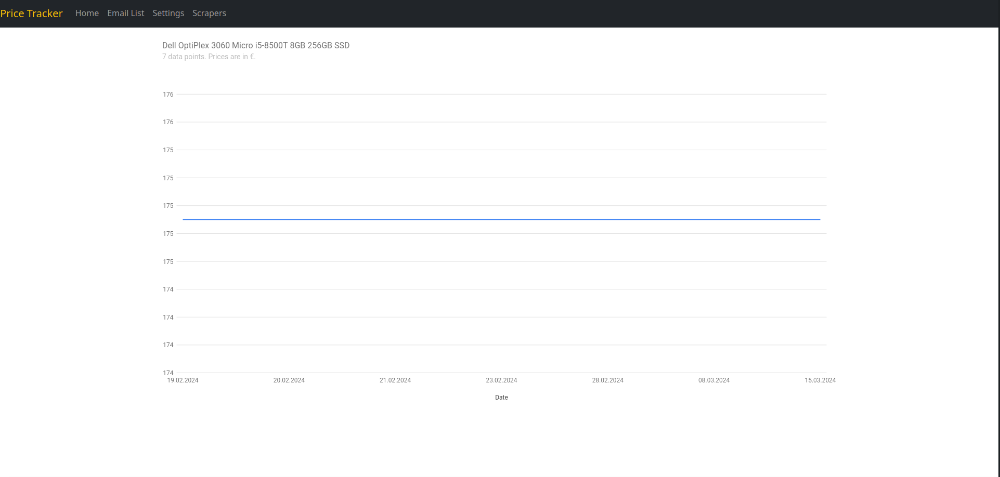
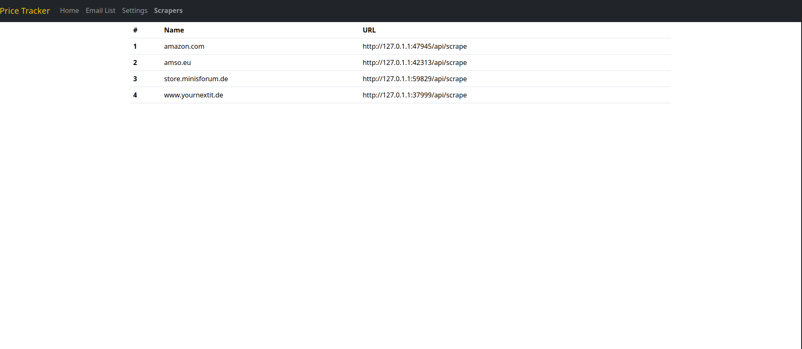

# Price-Scraper

Price-Scraper is a web scraping tool heavily inspired
by [donaldzou/Python-Amazon-Price-Tracker](https://github.com/donaldzou/Python-Amazon-Price-Tracker).
It is designed to track prices of products on various platforms.
This project serves as a platform to learn the Flask-Framework and to enhance my skills in Python and JavaScript.

## Motivation

The primary motivation behind this project was to learn making UIs with Flask and to have a tool which tracks prices of
products I'm interested in and notifies me about price drops.

## Features

- Web Scraping: Price-Scraper extracts pricing information from targeted e-commerce websites
- Graphes: Show graphes of a products price development
- Notifications: Show notifications if a price drops
- Modular scrapers: Each scraper is designed as a standalone Python application, following a plugin design for
  flexibility

## Screenshots
### Main page


### Details


### Scrapers


## Getting Started

### Start locally
To get started with Price-Scraper, follow these steps:

1. Clone the Repository: Clone the Price-Scraper repository to your local machine.
   ```commandline
   git clone https://github.com/cuupa/Price-Scraper.git
   ```

2. Install Dependencies: Install the required dependencies using pip.
   ```commandline
   pip install -r requirements.txt
   ```

3. Run the Application: Launch the Price-Scraper application.
   ```commandline
   python3 app.py
   ```

4. Run the Scrapers: Launch each scraper you want to use.
   ```commandline
   python3 scraper_modules/<module>/<module>.py
   ```

### Run as docker containers
Download the docker-compose.yml and run
   ```commandline
   docker-compose up -d
   ```

## Usage

1. Access the web user interface by navigating to the default port 5000. For example: http://localhost:5000.
2. Add Product URLs: Input the URLs of the products you wish to track.
3. Monitor Price Changes: Price-Scraper will continuously monitor the prices of the specified products and notify you of
   any alterations.
4. Explore Price History: Select a table row to visualize the price history in a chart format.
5. Review Registered Scrapers: Click on "Scrapers" to inspect the currently registered scraper services.
6. Adjust Scraping Interval: Access "Settings" to modify the current scraping interval according to your preferences.

## Create your own Scraper

Feel free to utilize any of the pre-existing scrapers available
in [price-scraper/scraper_modules](https://github.com/cuupa/price-scraper/scraper_modules) as a foundation for your
custom scraper.

To integrate your scraper with the application, you'll need to register it using a POST request. The payload should be
in JSON format and include the scraper's name along with the URL it operates on. Here's an example:

```json
{
  "url": "http://192.168.178.123:5041/api/scrape",
  "name": "my custom scraper"
}
```

Ensure that the URL you register your scraper with is a valid REST endpoint. It's important to note that the application
will invoke your scraper with any URL provided. Therefore, your scraper needs to be robust and capable of handling URLs
it isn't specifically designed to scrape.

## Roadmap
- Create a docker container
- Send browser notifications
- Send E-Mail notifications
- Add integration for ntfy, discord, telegram etc notifications
- Add a services.yaml for REST-endpoint documentation
- Fix non-functional "Link"-button
- Scrape new products immediately
- Provide a search for tracked products

## Contributions

Contributions to Price-Scraper are welcome! If you find any issues or have suggestions for improvements, feel free to open an issue or submit a pull request.

## License

This project is licensed under the MIT License.

## Acknowledgments

[donaldzou](https://github.com/donaldzou/) for the inspiration provided by his [donaldzou/Python-Amazon-Price-Tracker](https://github.com/donaldzou/Python-Amazon-Price-Tracker) project.

